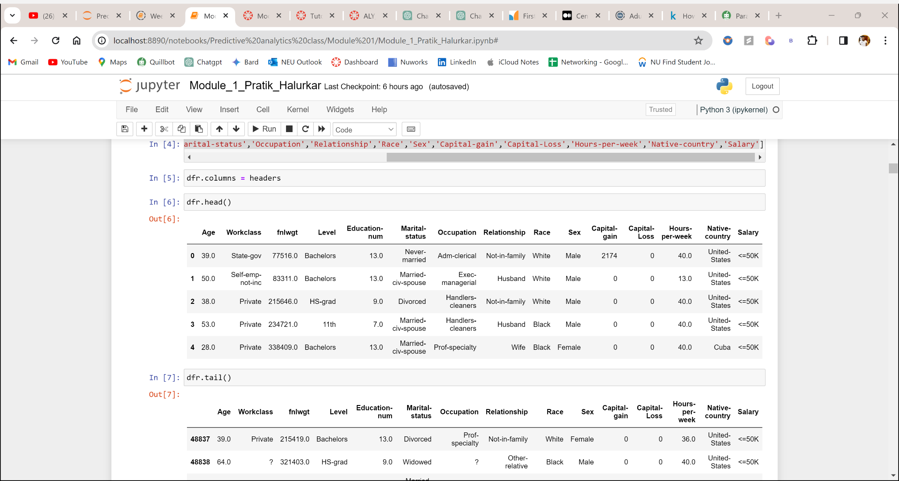

Pratik Amol Halurkar

Module 1 assignment

ALY6020: Predictive Analytics (CRN: 20356)

Prof. Justin Grosz

2/25/2024

# Introduction

The purpose of this initiative is to delve into census data pertaining
to attributes of US citizens – encompassing various attributes with a
clear objective to construct a model capable of discerning between low
and high-income individuals. In the context of ongoing efforts to
establish equal pay, our project aspires to unravel the nuanced
relationships between these attributes and affluence, ultimately
contributing to the enhancement of policies in the United States.

In order to accomplish our goal, we cleaned and preprocessed the data,
then utilized the KNN model to forecast the results.

# Data Cleaning & Preprocessing

The objective of this analysis is to preprocess the Adult Census dataset
for further investigation. Initially, I imported the dataset into Python
and utilized the head() function to preview the first five rows. It came
to my attention that the dataset lacked headers. To address this, I
referred to an additional file provided for the assignment, containing
variable types, and imported the following column names:

- Age

- Workclass

- fnlwgt

- Level

- Education-num

- Marital-status

- Occupation

- Relationship

- Race

- Sex

- Capital-gain

- Capital-Loss

- Hours-per-week

- Native-country

- Salary

As indicated in the variable type file, 'fnlwgt' was identified to be
ignored, and 'Salary' was specified as the dependent/target variable.
The 'Education-num' column was initially mislabeled as 'fnlwgt,' so I
corrected it to 'Level.' Descriptive analysis revealed that the dataset
comprises 48,842 entries and 14 columns, with 3 float, 3 integer, and 9
string data types.

I wanted to check if my dataset has any null values and when the command
was executed I found out that there few NA values in mostly of integer
datatypes and few in our dependent variable too. My next step was to
check for any garbage values and I found out that character " ? " was
recorded in quite a few columns. To tackle with this, I have replaced
those character with NAN values. Further I checked for duplicate values
and found out there were 6365 duplicated rows. As the duplicated will
cause problems in predictions for our model all the duplicated items
were dropped.

To deal with those NA values I checked how much percentage of data was
missing in each column:

Age 0.014125

Workclass 5.678367

Level 0.000000

Education-num 0.040022

Marital-status 0.000000

Occupation 5.701909

Relationship 0.000000

Race 0.000000

Sex 0.000000

Capital-gain 0.000000

Capital-Loss 0.000000

Hours-per-week 0.054147

Native-country 2.008146

Salary 0.040022

Feature Age had 6 NA values which was imputed by KNN Imputer as it is
numerical value

Feature Education_num had 17 NA values which was imputed by KNN Imputer
as it is numerical value

Feature Hours per week had 23 NA values which was imputed by KNN Imputer
as it is numerical value

Other columns had categorical data in it and the missing percentage was
more than that of numerical data so mode was used to fill those NA
values

Feature Workclass had 2799 NA values which was imputed by mode of the
column as it is categorical variable

Feature Occupation had 2809 NA values which was imputed by mode of the
column as it is categorical variable

Feature Native_country had 857 NA values which was imputed by mode of
the column as it is categorical variable

The missing values in dependable variable were 17 and those rows were
removed as it is not preferred to use any treatment method on the
dependable variable as it will make it artificial.

To check if the Level column and Education-num column meant the same and
after running the code it turns out the purpose of both the column was
same to count frequency of citizens in each category so the
education-num column was dropped.

Categorical Variable descriptive:

The number of unique categories shown in the above table helps us to
provided deeper analysis further.

Histograms

The capital gain histogram is highly right skewed.

Boxplots

The above boxplot shows that we have outliers in our dataset.

Heatmap

Heatmap of correlation coefficients of numerical columns showed that
there is no strong coorelation between which tell us there is less
chance of multicollinearity.

For our models to understand the categorical language I have used
Ordinal Encoder as it encodes each of the categorical variable in a
order Except for 'Level', 'Occupation', 'Native-country’. For the
remaining from the above I have used Label Encoder as these columns have
lot many unique features.

For the outliers from the above histogram plots, I have removed all the
outside the of 1st and 98th percentile. I have also checked the skewness
of the features and tried to keep them in the range of -0.5 to 0.5 using
Yeo Johnson method.

When I checked into the value counts of the dependable variable salary,
I found out that the data was imbalanced and needed to be balanced.
Importing SMOTETomek library I have used the upsampling method to
balance the dataset. I have used the up sampling method as we don't have
big dataset and any further loss of dataset will not provide good
accurates.

# Feature Selection

For feature selection I have used various methods such as correlation
matrix, SelectKbest ,Chi square and domain knowledge.

Heatmap

The above heatmap shows that there is some correlation between Salary
and Age, Sex, Capital Gain and hours per week.

SelectKbest and Chi square

Even though Capital gain had highest correlation coefficient and Chi
square value but if you look at is as logically in a domain capital gain
is nothing but a tax on the capital gain from all of your assests and
our goal is to build a model to see how accurately we can classify low
income from high income citizens.

I have selected **Age, Hour-per-week** and **Level** for my feature
selection. I am only selecting as per the assignment details only 3
variables to be selected has been strictly mentioned.

# K Value Selection

1.  **K = 5:**

    - A lower K value, such as 5, tends to make the model more sensitive
      to local patterns in the data. It considers a small number of
      nearest neighbors for classification, potentially capturing
      fine-grained distinctions in the dataset.

    - This lower K value may lead to a more flexible and responsive
      model, especially in situations where the decision boundaries are
      complex and nonlinear. However, it may also make the model more
      susceptible to noise or outliers.

2.  **K = 7:**

    - Choosing an intermediate value, like 7, strikes a balance between
      the sensitivity of a lower K and the robustness of a higher K. It
      aims to capture a broader perspective of the local structure in
      the data while still avoiding excessive sensitivity to outliers.

    - This intermediate K value is expected to offer a balanced
      trade-off, providing a reasonable compromise between capturing
      local patterns and maintaining model stability. It could be
      beneficial in scenarios with a moderate level of complexity.

3.  **K = 9:**

    - A higher K value, such as 9, tends to make the model more
      resilient to noise or outliers. It considers a larger number of
      nearest neighbors, leading to a smoother decision boundary that
      generalizes well to the overall dataset.

    - This higher K value may result in a more stable and robust model,
      particularly in situations where the dataset exhibits a
      considerable degree of variability. However, it may also risk over
      smoothing and missing finer details in the data.

# Model Evaluation

For further analysis I created X as independent variable with columns as
**Age, Hour-per-week** and **Level** and Y as dependent variable Salary.
Then I have split my data in 80% for training and 20% for testing.

Here is the classification report for different K values

1.  **K = 5:**

>  alt="A screenshot of a computer screen" />

1.  **Precision, Recall, and F1-Score:**

    - **Precision (Positive Predictive Value):** The model achieves
      approximately 73% precision for both low and high-income classes.
      This implies that when the model predicts an individual as low (or
      high) income, it is correct about 73% of the time.

    - **Recall (Sensitivity or True Positive Rate):** The recall for low
      income is 71%, suggesting that the model identifies 71% of actual
      low-income individuals. For high income, the recall is 74%,
      indicating that the model captures 74% of actual high-income
      individuals.

    - **F1-Score:** The F1-score, which balances precision and recall,
      is around 72% for both classes. This suggests a harmonious
      trade-off between precision and recall.

2.  **Accuracy:**

    - The overall accuracy of the model is 73%, signifying the
      proportion of correctly classified instances among the total.
      While accuracy is a valuable metric, especially in balanced
      datasets, it might not provide a complete picture when classes are
      imbalanced.

3.  **Confusion Matrix:**

    - The confusion matrix provides a detailed breakdown of the model's
      predictions. It reveals that the model correctly classifies 4446
      instances of low-income and 4785 instances of high-income.
      However, there are misclassifications, with 1828 instances of
      low-income individuals predicted as high-income and 1650 instances
      of high-income individuals predicted as low-income.

<!-- -->

2.  K = 7:

1.  **Precision, Recall, and F1-Score:**

    - **Precision** The model achieves approximately 74% precision for
      low income and 72% precision for high income. This indicates that,
      when the model predicts an individual as low (or high) income, it
      is correct about 74% (or 72%) of the time.

    - **Recall :** For low income, the recall is 70%, suggesting that
      the model identifies 70% of actual low-income individuals. For
      high income, the recall is 76%, indicating that the model captures
      76% of actual high-income individuals.

    - **F1-Score:** The F1-score is around 72% for low income and 74%
      for high income. This reflects a balanced trade-off between
      precision and recall for both classes.

2.  **Accuracy:**

    - The overall accuracy of the model is 73%, maintaining a consistent
      level with the **n_neighbors=5** model. This suggests that
      increasing the number of neighbors did not significantly impact
      the overall accuracy.

3.  **Confusion Matrix:**

    - The confusion matrix reveals that the model correctly classifies
      4389 instances of low-income and 4920 instances of high-income.
      However, there are misclassifications, with 1885 instances of
      low-income individuals predicted as high-income and 1515 instances
      of high-income individuals predicted as low-income.

> **K = 9:**
>
>  alt="A screenshot of a computer screen" />

1.  **Precision, Recall, and F1-Score:**

    - **Precision:** The model achieves approximately 75% precision for
      low income and 72% precision for high income. This indicates that,
      when the model predicts an individual as low (or high) income, it
      is correct about 75% (or 72%) of the time.

    - **Recall:** For low income, the recall is 69%, suggesting that the
      model identifies 69% of actual low-income individuals. For high
      income, the recall is 77%, indicating that the model captures 77%
      of actual high-income individuals.

    - **F1-Score:** The F1-score is around 72% for low income and 75%
      for high income. This reflects a balanced trade-off between
      precision and recall for both classes.

2.  **Accuracy:**

    - The overall accuracy of the model is 73%, maintaining a consistent
      level with the previous models. This suggests that further
      increasing the number of neighbors did not significantly impact
      the overall accuracy.

3.  **Confusion Matrix:**

    - The confusion matrix reveals that the model correctly classifies
      4351 instances of low-income and 4970 instances of high-income.
      However, there are misclassifications, with 1923 instances of
      low-income individuals predicted as high-income and 1465 instances
      of high-income individuals predicted as low-income.

<!-- -->

4.  

# Real-world Applicability

Considering the performance of our KNN models, we assess their
effectiveness in classifying various states of equality within the
dataset. The practicality of deploying these models in real-life
scenarios is a critical consideration.

Upon reflection, the models exhibit a balanced performance,
demonstrating consistent precision, recall, and F1-scores across
different values of K. This suggests that the models can effectively
distinguish between low and high-income individuals in controlled
settings.

However, the real-world applicability of these models demands careful
scrutiny. Several factors, such as evolving socio-economic dynamics and
potential shifts in feature importance, may impact their reliability.
Additionally, the models' sensitivity to outliers and noise should be
acknowledged.

In a reasoned argument, it can be concluded that while the KNN models
showcase competence in controlled environments, their robustness in
real-world scenarios requires ongoing validation and adaptation. Regular
model updates, incorporation of fresh data, and continuous monitoring
are essential to ensure their relevance and effectiveness in addressing
the complexities of societal dynamics and policy implications.
